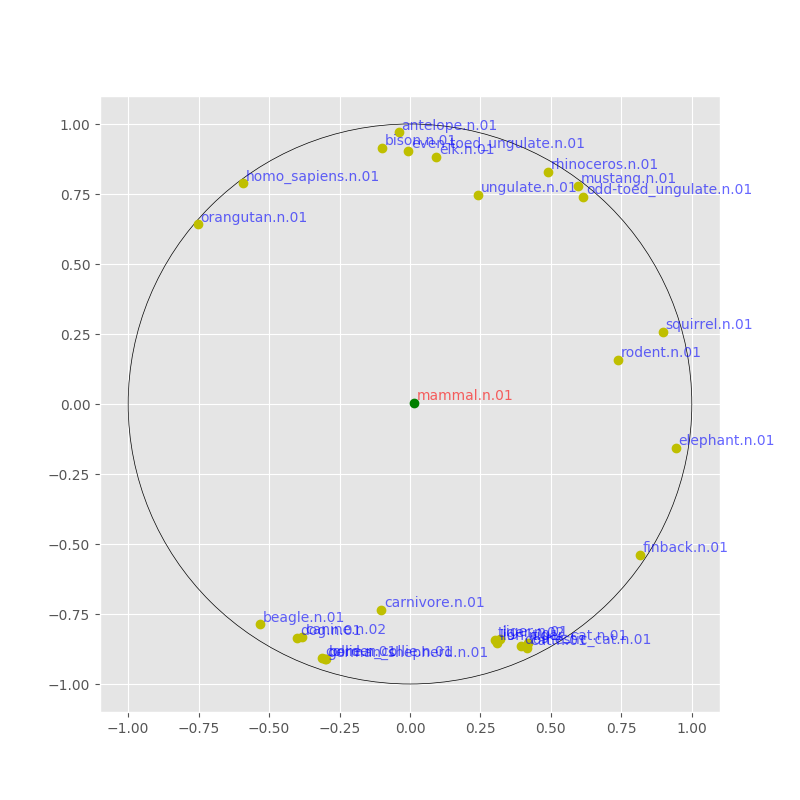
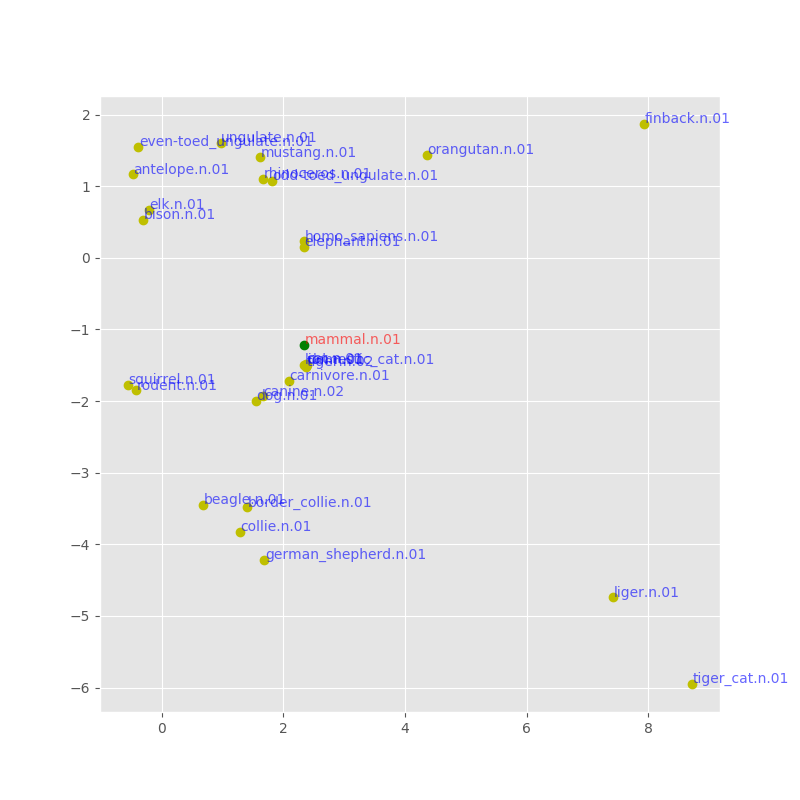

# torchemb

Implementation of Embedding Models in PyTorch




## Models

- [M. Nickel+, "Poincaré Embeddings for Learning Hierarchical Representations", NeurIPS2017](https://arxiv.org/pdf/1705.08039.pdf)
- [G. Kim+, "擬ユークリッド空間への単語埋め込み", 言語処理学会 第25回年次大会](https://www.anlp.jp/proceedings/annual_meeting/2019/pdf_dir/P7-4.pdf)
- [A. Okuno+, "Graph Embedding with Shifted Inner Product Similarity and Its Improved Approximation Capability", AISTATS2019](https://arxiv.org/abs/1810.03463)

# Examples

## Mammal Subtree

### 1. Dataset Preparation

requirements:

- nltk

```bash
python ./examples/mammal_subtree/create_mammal_subtree.py mammal_subtree.tsv
```

### 2. Apply Embeddings

#### Poincare Embeddings

```bash
PYTHONPATH=. python scripts/poincare_embeddings.py ../poincare-embedding/work/mammal_subtree.tsv embeddings.tsv
```

#### Pseudo-Euclidean Embeddings

```bash
PYTHONPATH=. python scripts/pseudo_euclidean_embeddings.py ../poincare-embedding/work/mammal_subtree.tsv embeddings.tsv
```

#### SIPS

```bash
PYTHONPATH=. python scripts/sips.py ../poincare-embedding/work/mammal_subtree.tsv embeddings.tsv 
```

### 3. plot

#### Euclidean Embedding

train
```bash
PYTHONPATH=. python ./scripts/pseudo_euclidean_embeddings.py mammal_subtree.tsv embeddings.tsv -e 2,0
```

plot
```bash
python ./examples/mammal_subtree/plot_mammal_subtree.py embeddings.tsv -o embeddings.png
```

#### Poincare Embedding

train
```bash
PYTHONPATH=. python ./scripts/poincare_embeddings.py mammal_subtree.tsv embeddings.tsv -e 2
```

plot
```bash
python ./examples/mammal_subtree/plot_mammal_subtree_poincare.py embeddings.tsv -o embeddings.png
```